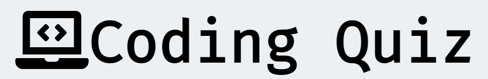
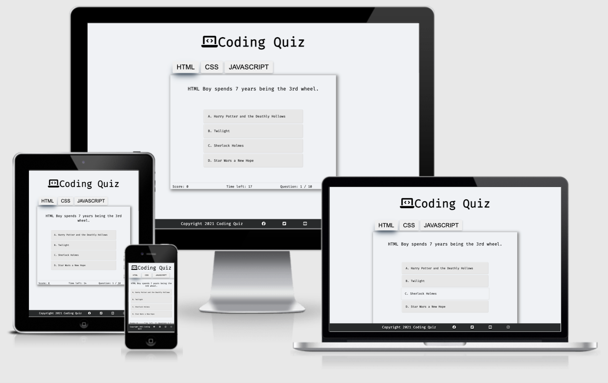
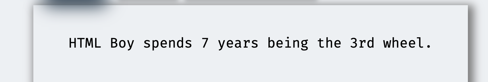
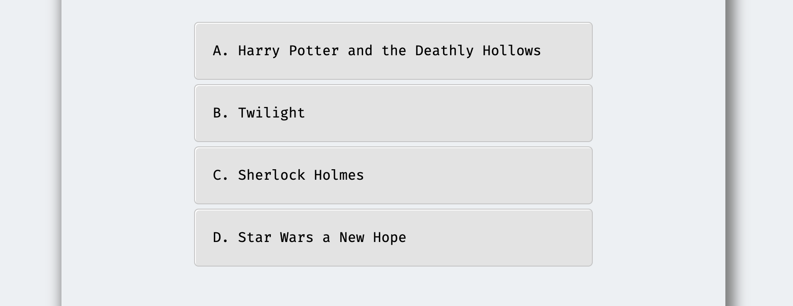
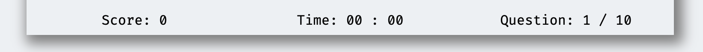
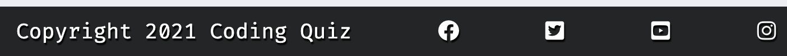
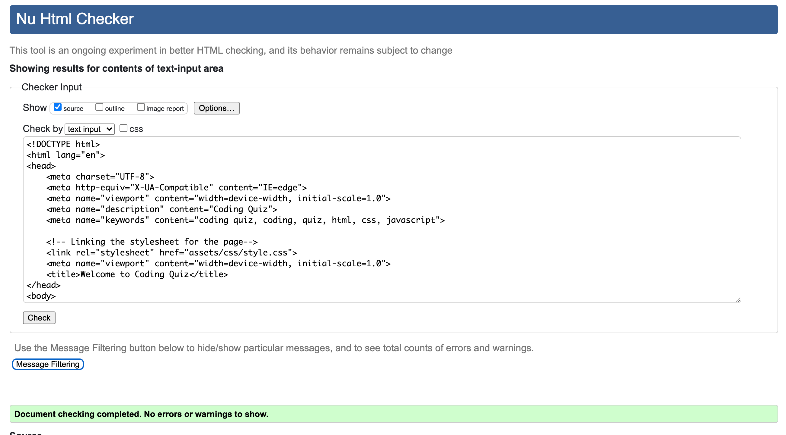
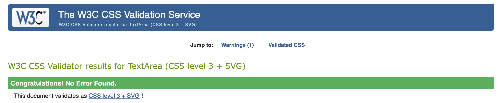
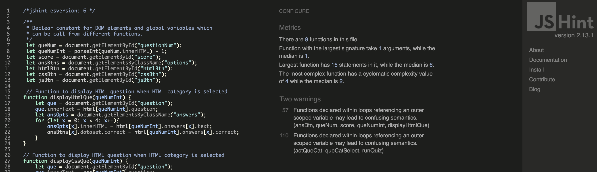
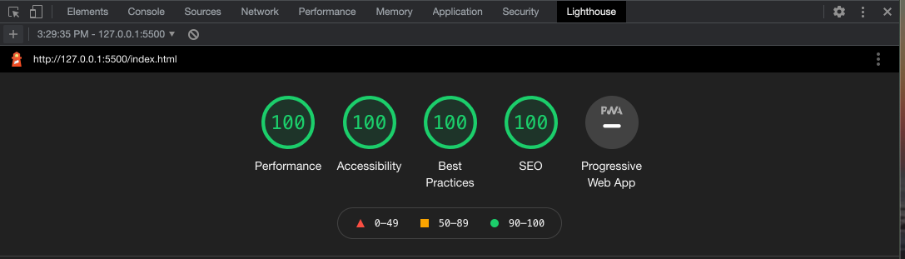

# Coding Quiz

Coding Quiz is a place to check the knowledge of a user in 3 specific coding language, **HTML**, **CSS** and **Javascript**. User of a website will have an option to chose from 3 different coding language they want to test their knowledge on. They will be asked 10 questions from the language they selected and at the end of 10 questions, it will display the score to the user. 

---

## Demo

A live demo of this website can be found [here](https://nofursad.github.io/codingquiz/)

[GitHub Repo](https://github.com/nofursad/codingquiz.git)

---
## Index - Table of Contents
* [User Experience (UX)](#user-experience-ux)
* [Technologies Used](#technologies)
* [Features](#features)
* [Testing](#testing)
* [Deployment](#deployment)
* [Credits](#credits)

## User Experience (UX)
* ### User Stories
  1. First time User
   * As a first time user, I want to be able to understand the main purpose of the website.
   * I want to be able to easily use the website for the purpose it was build for.
   * I want to be able to do the quiz of different category.
   * I want to be able to check my scores after I answered all the questions of the quiz.
  
  2. Returning User
   * As a returning visiter, I want to be able to quickly take the quiz.
   * I want to be able to check my scores.

  3. Frequent User
   * As a frequent user, I want to be able to store my scores.
   * I want to be able to compare my scores with my previous scores.

---

## Technologies Used
### Languages Used
1. [HTML5](https://en.wikipedia.org/wiki/HTML5)
2. [CSS3](https://en.wikipedia.org/wiki/CSS#CSS_3)
3. [Javascript](https://en.wikipedia.org/wiki/JavaScript)

### Frameworks, Libraries & Programs Used
* [SweetAlert2](https://sweetalert2.github.io/): was used to replace the javascirpt popup boxes with more responsive and customizable popup boxes.
* [Font Awesome](https://fontawesome.com/): was used to add scalable vector icons for UX purposes.
* [Google Fonts](https://fonts.google.com/): was used to import the Fira Code fonts into the stylesheet file (style.css) which was the default font for this page.
* [Git](https://git-scm.com/): was used for the purpose of version control of the website.
* [GitHub](https://github.com/): was used as the respository for the projects code after being pushed from Git.
* [Balsamiq](https://balsamiq.com/): was used to design the wireframes of the website.
* [Preview](https://en.wikipedia.org/wiki/Preview_(macOS)): was used to crop the images that is used in readme file.
---

## Features

 ### **The Header**
  * The header section only consist of logo for the website with the name of website.

  

### **Navigation Bar**
  * Navigation Bar is just below the header section with 3 buttons.
  * The buttons are not linked to new page but is programmed using Javascript to get the questions from different coding language.
  * The event handler in the script.js file listen to click on the button and response to them.
  * The button of the selected category will be highlighted so user can be aware of what category quiz they are doing.

  

### **Question Area**
  * When the page finish loading, the question area will be populated using HTML question as a default category. User can select from the navigation button to try the different catefory. The user will be asked 10 question from the selected category before displaying the result of the quiz.

  

### **Answer Area**
  * HTML is the category selected by default when user load the page. Answer area will be populated with 4 options for the question that is displayed. When user hover over the answer buttons, it will change the background color and scale to 1.02 times its original size.

  

### **Score Board**
  * User can view their score, the time they took on the quiz and the number of question they have attempted. Score will be updated everytime when user get the answer correct. Time will reset when user change the category. And question number will be updated everything user answer the question.

  

### **Footer**
  * Footer section is positioned at the very buttom of the page.
  * Footer consist of Copyright message and social-media icons.
  * Social media icon is linked to the Facebook, twitter, youtube and instagram.

  

### **Features which could be implemented in the future**
* Progress Bar for timer
 * A progress bar can be added in the scoreboard area as a visual representation of the time available to user to answer the questions.
* Icon and Popup Box for more Information
 * A icon can be added on the page which will bring the popup box with more information and option for the user.
* Option to Store scores
 * An user can give their name and the score can be stored so when user take the quiz again, they can compare the scores.
---

## Testing

### 1. Functionality

| **Test Label**  | **Test Action**  | **Expected Outcome**  | **Test Outcome**  |
|---|---|---|---|
| Quiz initial loadup  | Navigate to the quiz page  | Page should load with quiz rules  | Pass  |
| Default quiz to be HTML Category  | Load the page and check the highlight button  | Html button to be highlighted  |  Pass |
| Quiz Category Change  | Click CSS/Javascript button to change the quiz category  | User get question from selected category  | Pass  |
|Quiz Timer | Check the 30 sec timer in quiz | User to move to next question if no response in 30 sec | Pass |
|Popup SweetAlert|loaded the page, selected correct and incorrect answer and finished the quiz| Popup alert with relevant message| Pass|
  
### 2. Browser Compatibility
 Testing has been carried out on the following browsers :
* Chrome Version 95.0.4638.69 (Official Build) (64-bit)
* Firefox Version 94.0.1 (64-bit)
* Edge Version 95.0.1020.44 (Official build) (64-bit)
* Safari on macOS Big Sur Ver 11.6.1 (Safari Version 15.1 (16612.2.9.1.30, 16612))

### 3. Responsiveness
* I have tested the website for its responsiveness on different screen size device using the devtools device toolbar in chrome browser.I have tested for very small screen (iPhone 5 with width 320px) and very large screen (5k iMac Pro with resolution 5120 x 2880 px).* I have confirmed that all the text in all section of the website are readable and easy to understand.

---

## Bugs

### **Solved Bugs**
When i tested the javascript codes in the jshint.com, I found out that I was missing some of the semicolon after finishing my code.  
I went back and corrected that in script.js file by adding semicolon wherever it was missing.  
  
### **Unfixed Bug**
No Unfixed Bugs.  
  
## Validator Testing
* [HTML Validator](https://validator.w3.org/): I tested the code through the official **W3C validator** and all test pass without any error.

  
* [CSS](https://jigsaw.w3.org/css-validator/):  I tested the code through the official **W3C (Jigsaw) validator** and all test pass without any error.

  
* [Javascript](https://jshint.com/): I tested the javascript code throught the website **JSHINT.COM** and all code pass without any error.

  
* **Accessibility**: I have confirmed that texts on the website are easy to read by choosing the right color and fonts. And confirm website is accessible by running it through **lighthouse** in devtools.  
  

 ## **Deployment**
**Steps to Deploy this site**

1. From the projects repository go to the **settings** tab which will take you to settings page.
1. On the left hand menu near the bottom click on the **pages** link which will open the GitHub Pages tab.
1. Under **Source** section, click on the dropdown menu to get the option available.
1. Select the first option **Main** and then click on **Save** button to save the changes.
1. At the top of the GiHub Pages tab, message will appear saying  **Your site is ready to be published** following with the link to access the page.
1. Once the site is published to the link provided, the message will change to **Your site is published** following with the link to access the page.

You can access the live site via the following link [A Game of Snake](https://gibbo101.github.io/snake-game/).

**Cloning the repository to work on duplicate file**
1. Go to the [https://github.com/nofursad/codingquiz.git](https://github.com/nofursad/codingquiz.git) to access the repository on GitHub.
2. Click on the "Code" button which will bring a dropdown box with more option.
3. Click on the HTTPs and click on copy icon next to the link.
4. Open a GitBash terminal / build-in terminal and open a directory where you want to clone it.
5. Type "git clone" them paste in the link that was copied from git and hit Enter to start the cloning process. 

## Credits

### Content
* All the questions for the quiz was created by developer.
### Code
* Code for the popup boxes was taken from [sweetAlert2](https://sweetalert2.github.io/#examples).
* Code for the box-shadows was take from the [Getcssscan.com](https://getcssscan.com/css-box-shadow-examples).

### Acknowledgments
* All member of slack community who helped and adviced me when I was stuck.
* Thank you to my mento Brian Macharia who was very patient while helping me to help myself by providing lots of pointers and hints. He also redirected me to different resources which was very usefull in this project. 