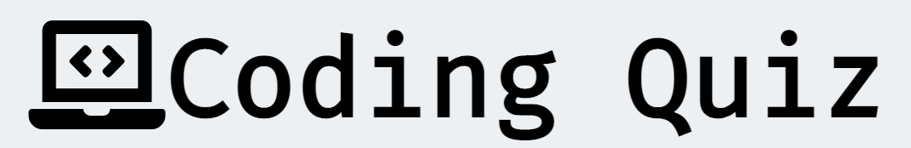

# Coding Quiz

Coding Quiz is a place to check the knowledge of a user in 3 specific coding language, **HTML**, **CSS** and **Javascript**. User of a website will have an option to chose from 3 different coding language they want to test their knowledge on. They will be asked 10 questions from the language they selected and at the end of 10 questions, it will display the score to the user. 

## Demo

A live demo of this website can be found [here](https://nofursad.github.io/codingquiz/)

[GitHub Repo](https://github.com/nofursad/codingquiz.git)

![Responsiveness]

## Gitpod Reminders

To run a frontend (HTML, CSS, Javascript only) application in Gitpod, in the terminal, type:

------

## Release History

------

---

Happy coding!
