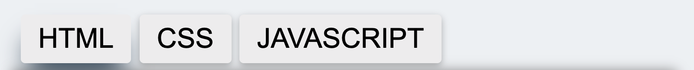

# Coding Quiz

Coding Quiz is a place to check the knowledge of a user in 3 specific coding language, **HTML**, **CSS** and **Javascript**. User of a website will have an option to chose from 3 different coding language they want to test their knowledge on. They will be asked 10 questions from the language they selected and at the end of 10 questions, it will display the score to the user. 

## Demo

A live demo of this website can be found [here](https://nofursad.github.io/codingquiz/)

[GitHub Repo](https://github.com/nofursad/codingquiz.git)

## Strategy

The main purpose of this website is to test the knowledge of the user on HTML, CSS and Javascript programming language. This website is targeted towards the coder like myself where they can check their knowledge on the coding language.

------

## Technologies

1. HTML5
2. CSS3
3. Javascript

## Features

* **The Header**
  * The header section only consist of logo for the website with the name of website.

  

* **Navigation Bar**
  * Navigation Bar is just below the header section with 3 buttons.
  * The buttons are not linked to new page but is programmed using Javascript to get the questions from different coding language.
  * The event handler in the script.js file listen to click on the button and response to them.
  * The button of the selected category will be highlighted so user can be aware of what category quiz they are doing.

  

* **Question Area**
  * When the page finish loading, the question area will be populated using HTML question as a default category. User can select from the navigation button to try the different catefory. The user will be asked 10 question from the selected category before displaying the result of the quiz.

  

* **Answer Area**
  * HTML is the category selected by default when user load the page. Answer area will be populated with 4 options for the question that is displayed. When user hover over the answer buttons, it will change the background color and scale to 1.02 times its original size.

  

* **Score Board**
  * User can view their score, the time they took on the quiz and the number of question they have attempted. Score will be updated everytime when user get the answer correct. Time will reset when user change the category. And question number will be updated everything user answer the question.

  

* **Footer**
  * Footer section is positioned at the very buttom of the page.
  * Footer consist of Copyright message and social-media icons.
  * Social media icon is linked to the Facebook, twitter, youtube and instagram.

  

------

---

Happy coding!
